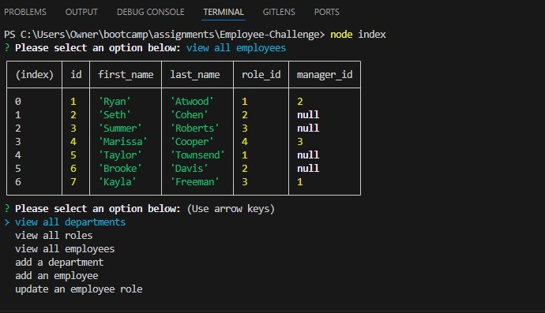

# Employee Tracker 

  ## Table of Contents
  
  - [Installation](#installation)
  - [Usage](#usage)
  
  ## Description
  This is an employee tracker made with mysql and inquirer. The user is presented with multiple prompts to decide what the user would like to do. The user can update employee roles, add employees, add roles, and view all current roles, employees, and departments.

  ## Video Link
  https://drive.google.com/file/d/1VUMeaIvE-7Ug5rqh1jkGMB13OD7G86Cq/view?usp=sharing

  ## Screenshot
  

  ## Installation
  run 'npm i inquirer@8.2.4' in the console. 
  run 'npm install --save mysql2' in the console.

  ## Usage
  run 'mysql -u root -p' in the console and enter password. 
  run 'source db/schema.sql' in the console. 
  run 'source db/seeds.sql' in the console. 
  run 'node index' in the console.
